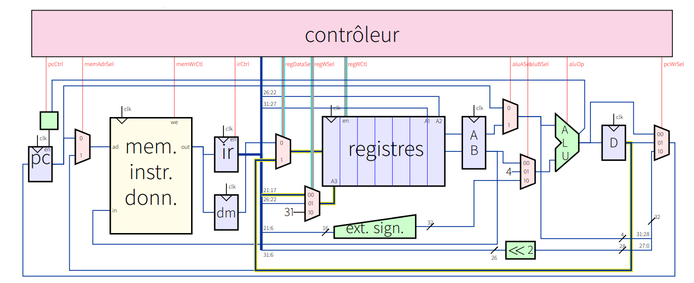

# RISC-V Verilog Processor 

## Vue d'ensemble
Ce projet est une implémentation simple d'un processeur RISC-V utilisant Verilog. Il prend en charge l'ISA RV32I. L'objectif est de créer un cœur synthétisable sur FPGA optimisé en taille.

## Fonctionnalités
- Implémentation de l'ISA Integer de RISC-V (RV32I)
- Opérations de base de l'ALU
- Fichier de registres
- Récupération et décodage des instructions

## Structure de core
Le design est basé sur le coeur de professeur Alain Merigot de l'université de Paris-Saclay et des explications de *livre Computer Organization and Design RISC-V Edition*, c'est un coeur riscv 32bit non pipeliné avec une memoire données/instructions unifié.

__Figure 1: RISCV 32bit Core__



## Pour Commencer
### Prérequis
- oss-cad-suite pour synthesisez le design et la verification formelle inclus pour chaque element
- Toolchain GNU gcc RISC-V pour compiler le code assembleur de test
- riscv-formal (fait partie de oss-cad-suite) pour verifier formellement l'adherance a l'ISA.

## Structure du Répertoire
```
/RISCV-Verilog-Processor
├── src/                # Fichiers sources
├── test/               # Fichiers de banc de test pour la verification formelle avec SBY
└── docs/               # Documentation et rapport
```
## Licence
Ce projet est sous licence MIT.

## Remerciements
- Professeur Alain Merigot de l'université Paris-Saclay
- [Fondation RISC-V](https://riscv.org/)
- [Verilog HDL](https://en.wikipedia.org/wiki/Verilog)
- *Computer Organization and Design RISC-V Edition: The Hardware Software Interface* (2nd Edition, 11 décembre 2020) par David A. Patterson et John L. Hennessy. ISBN: 9780128203316 (broché).

