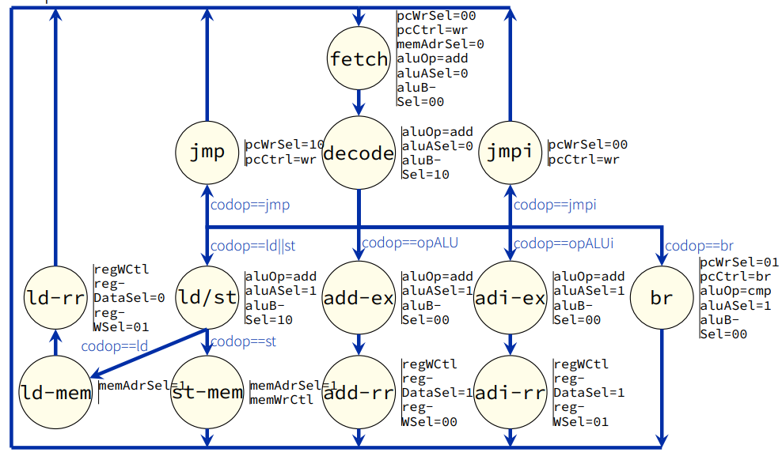

# Conception de Micro-séquenceur

## Description fonctionelle

Le micro-séquenceur est une machine à états finis (FSM) qui contrôle tous les signaux de commande du processeur dans le cadre de la conception d’un processeur **RISC-V** 32 bits.

### Description des Ports

#### input:
- **codop** : code d'operation pris des bits approprié de l'instruction courant stocké dans *Instrucion Register*

#### output :

##### Interface Program Counter:
- **pcWrSel** : Sélecteur pour l’écriture du PC (`00`, `01`, `10`)
- **pcCtrl** : Mode de contrôle du PC (`wr` pour écrire, `br` pour branchement)

##### Interface Mémoire :
- **memAdrSel** : Sélection d’adresse mémoire (`0`, `1`)
- **memWrCtl** : Contrôle d’écriture mémoire (utilisé pour les opérations d'écriture)

##### Opérations de l’Unité Arithmétique et Logique (ALU) :
- **aluOp** : Opération à effectuer (`add`, `cmp`)
- **aluASel** : Sélection de l’opérande A (`0`, `1`)
- **aluBSel** : Sélection de l’opérande B (`00`, `10`)

##### Contrôle des Registres :
- **regWCtl** : Signal de contrôle pour l’écriture dans un registre
- **regDataSel** : Sélection de la source des données à écrire (`0`, `1`)
- **regWSel** : Sélection du registre cible (`00`, `01`)

##### Signaux Conditionnels (Codop - Code d’Opération) :
- **codop == ld || st** : Instruction de chargement ou de stockage
- **codop == opALU** : Opérations arithmétiques ou logiques
- **codop == opALUi** : Opérations arithmétiques ou logiques immédiates
- **codop == br** : Instruction de branchement
- **codop == jmp** : Saut inconditionnel
- **codop == jmpi** : Saut indirect

### Machine d’État

La machine d’état évolue en fonction de l’instruction décodée. Chaque état correspond à une étape clé de l’exécution de l’instruction (fetch, decode, execute, write-back, etc.). Le graphe suivant illustre cette machine d’état :

*__Figure 2 : Micro-séquenceur pour un cœur RISC-V 32 bits__

## Tests et validation

...

